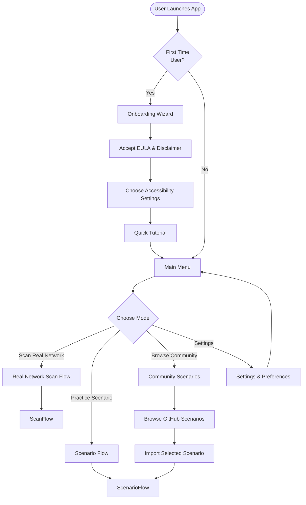
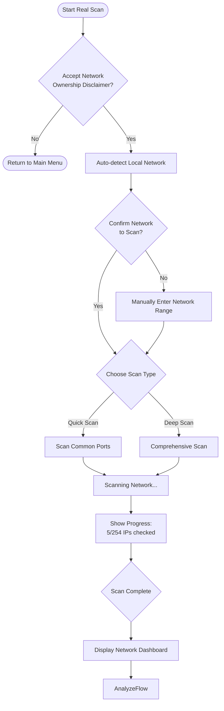
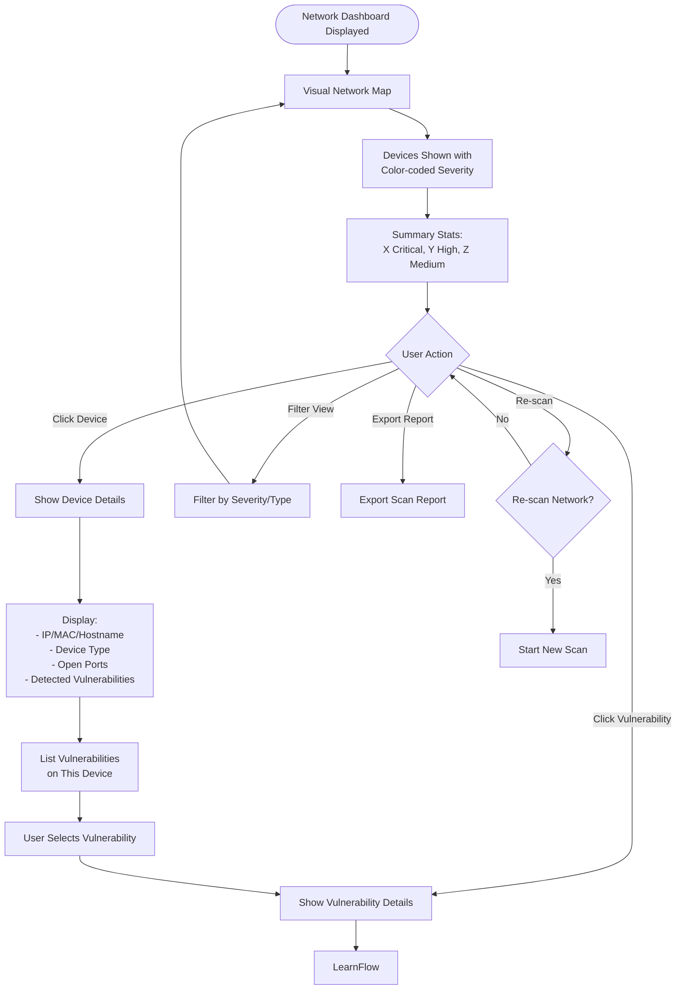
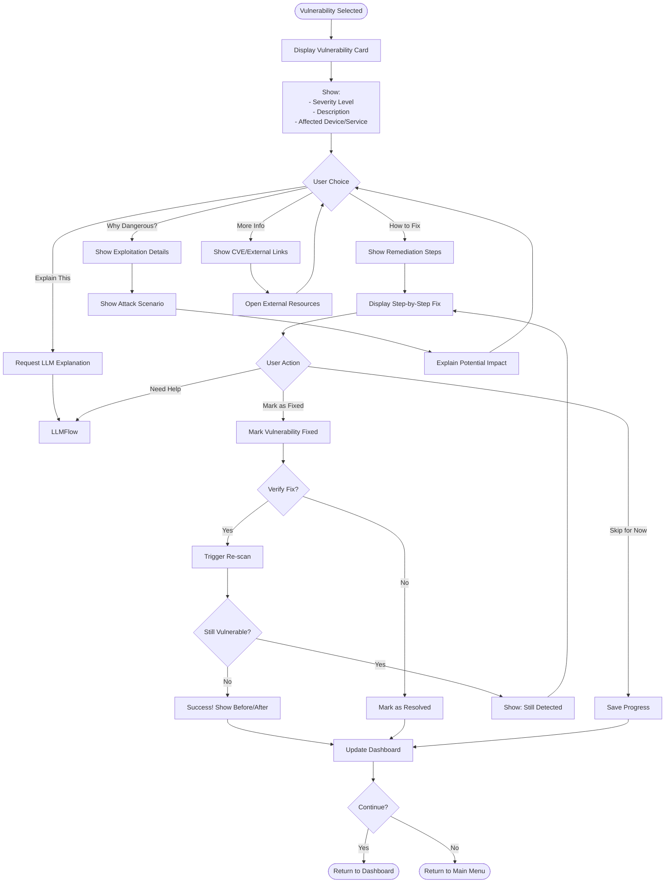
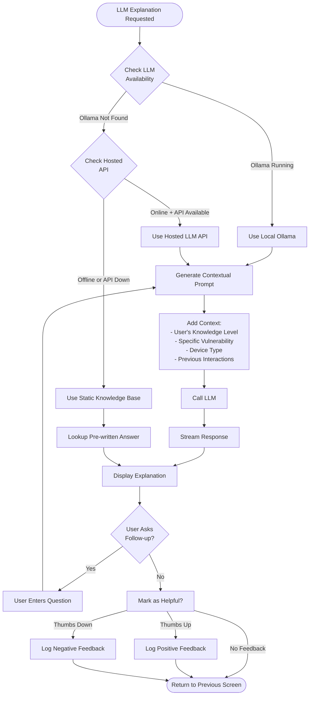
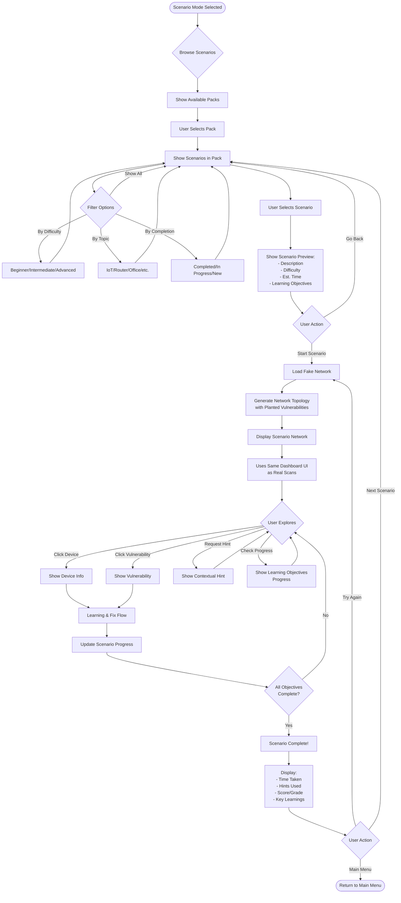
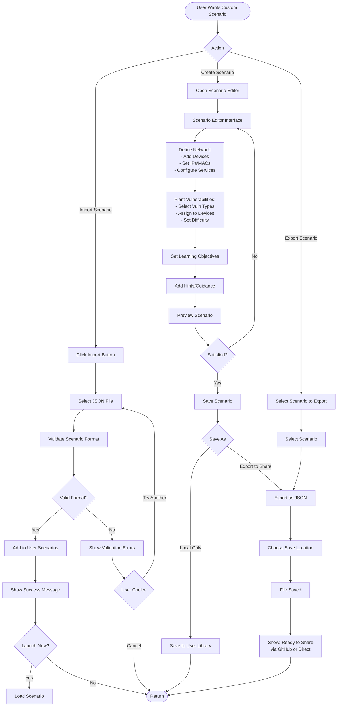
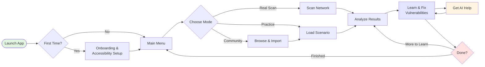
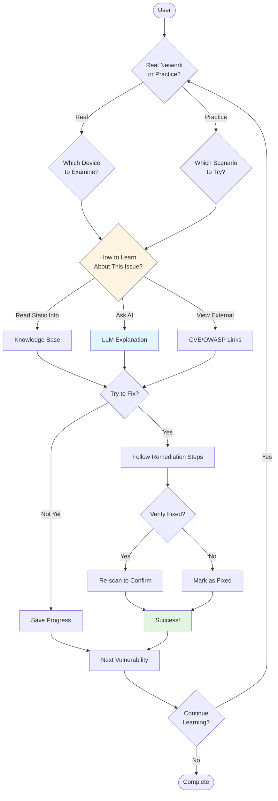

# Cybersecurity Teaching Tool - User Flow Diagrams

## Main User Flow



## Real Network Scan Flow



## Network Dashboard & Analysis Flow



## Learning & Vulnerability Detail Flow



## LLM Interaction Flow



## Scenario-Based Learning Flow



## Import/Export Custom Scenario Flow



## Accessibility Mode Switching Flow

```mermaid
flowchart TD
    Start([User Accesses Accessibility]) --> Entry{Entry Point}
    
    Entry -->|First Launch| Onboarding[Onboarding Wizard]
    Entry -->|Settings Menu| Settings[Settings Screen]
    Entry -->|Quick Toggle| QuickSwitch[Quick Accessibility Panel]
    
    Onboarding --> AccessibilityOptions[Show Accessibility Options]
    Settings --> AccessibilityOptions
    QuickSwitch --> AccessibilityOptions
    
    AccessibilityOptions --> Options{Select Options}
    
    Options -->|Screen Reader| ScreenReader[Enable Screen Reader Mode]
    Options -->|Visual Mode| VisualMode[Enable Visual Enhancements]
    Options -->|Keyboard Nav| KeyboardMode[Optimize Keyboard Navigation]
    Options -->|Color Settings| ColorSettings[Choose Color Scheme]
    Options -->|Motion Settings| MotionSettings[Reduce Motion Options]
    Options -->|Font Settings| FontSettings[Adjust Font Size/Type]
    
    ScreenReader --> SROptions[Configure:<br/>- Audio Speed<br/>- Verbosity Level<br/>- Auto-read New Content]
    
    VisualMode --> VOptions[Configure:<br/>- Zoom Level<br/>- Focus Highlighting<br/>- High Contrast Mode]
    
    KeyboardMode --> KBOptions[Configure:<br/>- Tab Order<br/>- Shortcuts<br/>- Skip Links]
    
    ColorSettings --> ColorOptions[Choose:<br/>- Normal<br/>- Protanopia<br/>- Deuteranopia<br/>- Tritanopia<br/>- High Contrast]
    
    MotionSettings --> MotionOptions[Configure:<br/>- Disable Animations<br/>- Reduce Transitions<br/>- Static Elements Only]
    
    FontSettings --> FontOptions[Configure:<br/>- Font Size (100-200%)<br/>- Font Family<br/>- Line Spacing]
    
    SROptions --> Preview[Preview Changes]
    VOptions --> Preview
    KBOptions --> Preview
    ColorOptions --> Preview
    MotionOptions --> Preview
    FontOptions --> Preview
    
    Preview --> Satisfied{Satisfied?}
    
    Satisfied -->|No| AccessibilityOptions
    Satisfied -->|Yes| Save[Save Preferences]
    
    Save --> ApplyChanges[Apply Changes Globally]
    ApplyChanges --> ShowConfirmation[Show Confirmation]
    
    ShowConfirmation --> QuickAccessSetup{Add Quick<br/>Access Toggle?}
    
    QuickAccessSetup -->|Yes| AddToToolbar[Add Accessibility Button<br/>to Toolbar]
    QuickAccessSetup -->|No| Done([Return to Previous Screen])
    
    AddToToolbar --> Done
```

## Settings & Preferences Flow

```mermaid
flowchart TD
    Start([Settings Menu Opened]) --> Categories[Show Setting Categories]
    
    Categories --> Select{Select Category}
    
    Select -->|Accessibility| AccessibilityFlow[Accessibility Flow]
    Select -->|Account/Profile| Profile[Profile Settings]
    Select -->|LLM Preferences| LLMSettings[LLM Configuration]
    Select -->|Network Scanning| ScanSettings[Scan Preferences]
    Select -->|Data & Privacy| PrivacySettings[Privacy Controls]
    Select -->|About| AboutScreen[About & Help]
    
    Profile --> ProfileOptions[Configure:<br/>- Display Name<br/>- Knowledge Level<br/>- Learning Goals<br/>- Avatar/Icon]
    
    LLMSettings --> LLMOptions[Configure:<br/>- Prefer Local/Hosted<br/>- API Key (Optional)<br/>- Response Detail Level<br/>- Language]
    
    ScanSettings --> ScanOptions[Configure:<br/>- Default Scan Type<br/>- Timeout Settings<br/>- Port Ranges<br/>- Auto-scan Options]
    
    PrivacySettings --> PrivacyOptions[Configure:<br/>- Data Collection<br/>- Telemetry (Opt-in)<br/>- Export User Data<br/>- Delete All Data]
    
    AboutScreen --> AboutInfo[Show:<br/>- Version Info<br/>- Licenses<br/>- Contact/Support<br/>- Check for Updates]
    
    ProfileOptions --> SaveProfile[Save Changes]
    LLMOptions --> TestConnection[Test LLM Connection]
    ScanOptions --> SaveScan[Save Changes]
    PrivacyOptions --> SavePrivacy[Save Changes]
    
    TestConnection --> ConnectionResult{Connection OK?}
    ConnectionResult -->|Yes| SaveLLM[Save Changes]
    ConnectionResult -->|No| ShowError[Show Error Details]
    ShowError --> LLMOptions
    
    SaveProfile --> Confirm[Show Confirmation]
    SaveLLM --> Confirm
    SaveScan --> Confirm
    SavePrivacy --> Confirm
    
    AboutInfo --> UpdateCheck{Update Available?}
    UpdateCheck -->|Yes| PromptUpdate[Prompt to Update]
    UpdateCheck -->|No| UpToDate[Show: Up to Date]
    
    PromptUpdate --> UpdateChoice{User Choice}
    UpdateChoice -->|Update Now| Download[Download Update]
    UpdateChoice -->|Later| Done([Return])
    
    Download --> Install[Install & Restart]
    Install --> RestartApp([App Restarts])
    
    UpToDate --> Done
    Confirm --> Done
```

## Simplified High-Level User Journey



## Key Decision Points Summary



---

## How to Use These Diagrams

### Viewing the Diagrams
These diagrams are written in Mermaid syntax. To view them rendered:

1. **GitHub/GitLab**: Paste into a .md file in a repository (renders automatically)
2. **Mermaid Live Editor**: Copy/paste into https://mermaid.live/
3. **VS Code**: Install "Markdown Preview Mermaid Support" extension
4. **Notion**: Use /code block with mermaid language
5. **Online Markdown Editors**: Most support Mermaid (Typora, StackEdit, etc.)

### Diagram Legend

**Shapes:**
- `([Rounded])` = Start/End points
- `[Rectangle]` = Process/Action
- `{Diamond}` = Decision point
- `((Circle))` = Connection point

**Flow Types:**
- `-->` = Standard flow
- `-->|Label|` = Conditional flow with label

### Using These Flows for Development

1. **UI Design**: Each box represents a screen or modal that needs designing
2. **API Endpoints**: Each action suggests backend endpoints needed
3. **User Testing**: Follow these paths during usability testing
4. **Feature Planning**: Each branch represents a feature to implement
5. **Bug Tracking**: Reference specific flow paths when reporting issues

### Key Patterns to Notice

1. **Consistency**: Dashboard experience is the same for real scans and scenarios
2. **Help Always Available**: LLM help is accessible from any learning context
3. **Progressive Disclosure**: Users aren't overwhelmed - information revealed as needed
4. **Accessibility First**: Mode switching available throughout the experience
5. **Multiple Paths**: Users can learn by doing OR by reading, their choice

---

## Next Steps for User Flow

Once these flows are validated:

1. **Create Wireframes**: Design actual screens for each box in the flows
2. **Write User Stories**: Convert each flow path into development user stories
3. **Identify Edge Cases**: What happens when things go wrong in each flow?
4. **Plan Transitions**: How do screens transition? Animations? Loading states?
5. **Accessibility Audit**: Review each flow for accessibility compliance
6. **User Testing**: Test these flows with target users before building

---

*Document Version: 1.0*  
*Last Updated: December 6, 2024*  
*Related Document: CyberSec-Teaching-Tool-Design-Doc.md*
